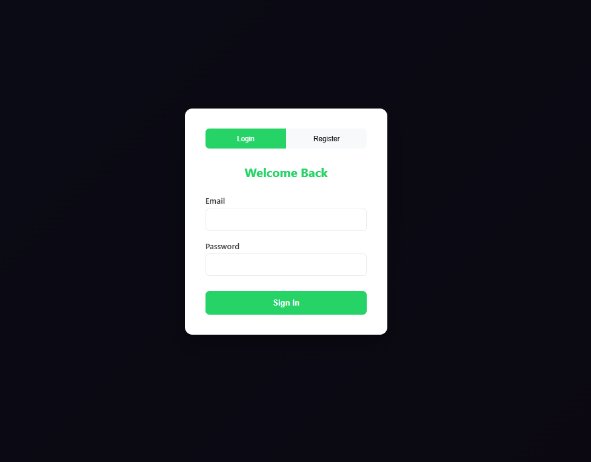
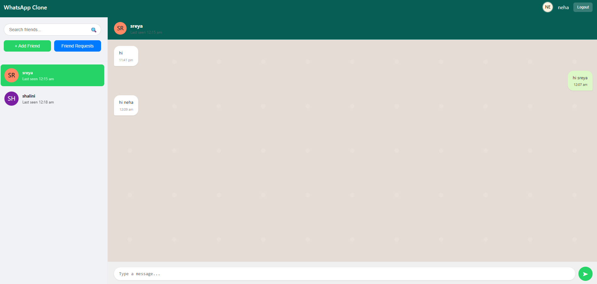
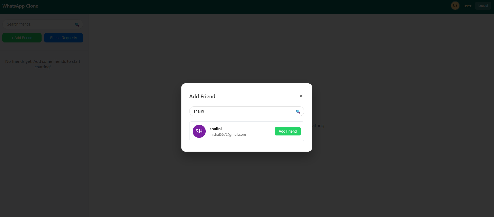
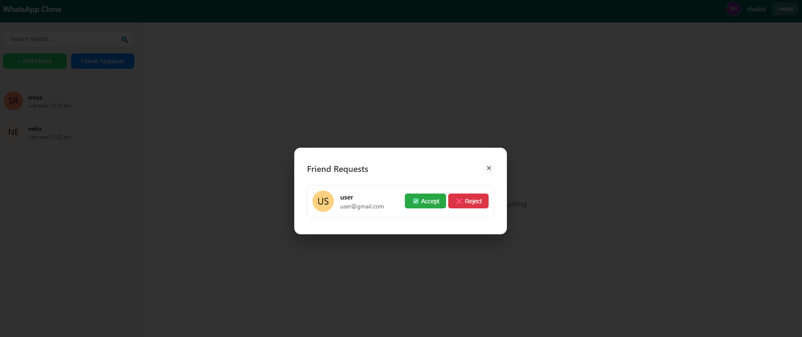
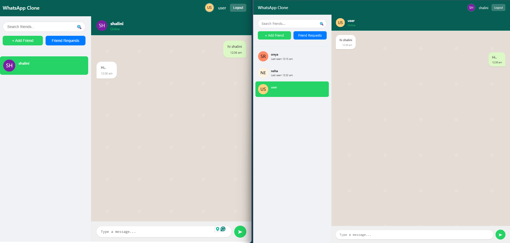

# Chat Application

A real-time chat application built with Node.js, Express, Socket.io, and MongoDB. Features include user authentication, friend system, real-time messaging, typing indicators, and online status tracking.

Check out the live demo here: [Chat Application Demo](https://web-socket-frontend-rust.vercel.app/)


## Features

- **User Authentication**: Secure registration and login system with JWT tokens
- **Friend System**: Send, accept, and reject friend requests
- **Real-time Messaging**: Instant message delivery using Socket.io
- **Typing Indicators**: See when friends are typing
- **Online Status**: Track when friends are online or offline
- **Responsive Design**: Works on desktop and mobile devices
- **Message History**: Persistent message storage
- **User Search**: Find and add friends by username or email
- **Avatar System**: Automatic avatar generation for users

## Demo Screenshots

### Authentication Screen


*Clean and modern authentication interface with tabbed login/register forms*

### Main Chat Interface


*WhatsApp-style interface with friends list sidebar and chat area*

### Friend Management


*Search and add friends functionality with real-time user search*

### Friend Requests


*Manage incoming friend requests with accept/reject options*

### Real-time Chat


*Real-time messaging with message bubbles, timestamps, and delivery status*

## Tech Stack

### Backend
- **Node.js**: JavaScript runtime
- **Express.js**: Web application framework
- **Socket.io**: Real-time bidirectional communication
- **MongoDB**: NoSQL database
- **Mongoose**: MongoDB object modeling
- **JWT**: JSON Web Tokens for authentication
- **bcryptjs**: Password hashing
- **Helmet**: Security middleware
- **Express Rate Limit**: Rate limiting middleware

### Frontend
- **HTML5**: Markup language
- **CSS3**: Modern styling with animations
- **JavaScript ES6+**: Client-side functionality
- **Socket.io Client**: Real-time communication

## Installation

### Prerequisites
- Node.js (v14 or higher)
- MongoDB (local or cloud instance)
- npm or yarn package manager

### Setup Instructions

1. **Clone the repository**
   ```bash
   git clone https://github.com/yourusername/whatsapp-clone.git
   cd whatsapp-clone
   ```

2. **Install dependencies**
   ```bash
   npm install
   ```

3. **Environment Configuration**
   Create a `.env` file in the root directory:
   ```env
   PORT=3000
   MONGODB_URI=mongodb://localhost:27017/whatsapp-clone
   JWT_SECRET=your_super_secret_jwt_key_here
   CLIENT_URL=http://localhost:3000
   ```

4. **Start MongoDB**
   Make sure MongoDB is running on your system:
   ```bash
   # For local MongoDB installation
   mongod
   
   # Or use MongoDB Atlas cloud service
   ```

5. **Run the application**
   ```bash
   # Development mode
   npm run dev
   
   # Production mode
   npm start
   ```

6. **Access the application**
   Open your browser and navigate to `http://localhost:3000`

## Project Structure

```
whatsapp-clone/
├── public/
│   └── index.html          # Frontend application
├── server.js               # Main server file
├── package.json           # Dependencies and scripts
├── .env                   # Environment variables
├── .gitignore            # Git ignore rules
└── README.md             # Project documentation
```

## API Endpoints

### Authentication
- `POST /api/register` - Register new user
- `POST /api/login` - User login

### User Management
- `GET /api/users/search` - Search users by username/email

### Friends
- `GET /api/friends` - Get user's friends list
- `GET /api/friends/requests` - Get pending friend requests
- `POST /api/friends/request` - Send friend request
- `POST /api/friends/accept` - Accept friend request
- `POST /api/friends/reject` - Reject friend request

### Messages
- `GET /api/messages/:userId` - Get chat history with specific user

## Socket Events

### Client to Server
- `authenticate` - Authenticate socket connection
- `send-message` - Send message to another user
- `typing` - Send typing indicator
- `mark-messages-read` - Mark messages as read

### Server to Client
- `authenticated` - Authentication confirmation
- `new-message` - Receive new message
- `message-sent` - Message delivery confirmation
- `user-typing` - Typing indicator from other user
- `friend-online` - Friend came online
- `friend-offline` - Friend went offline
- `friend-request` - New friend request received
- `friend-accepted` - Friend request accepted

## Security Features

- **Password Hashing**: bcryptjs with salt rounds
- **JWT Authentication**: Secure token-based authentication
- **Rate Limiting**: Prevent API abuse
- **Input Validation**: Server-side validation for all inputs
- **Helmet**: Security headers middleware
- **CORS Protection**: Configured cross-origin resource sharing

## Database Schema

### User Model
```javascript
{
  username: String (required, unique),
  email: String (required, unique),
  password: String (required, hashed),
  avatar: String (auto-generated),
  status: String (online/offline/busy),
  lastSeen: Date,
  friends: [{ user: ObjectId, addedAt: Date }],
  friendRequests: [{ from: ObjectId, sentAt: Date }]
}
```

### Message Model
```javascript
{
  sender: ObjectId (required),
  receiver: ObjectId (required),
  content: String (required),
  messageType: String (text/image/file),
  isRead: Boolean,
  readAt: Date,
  createdAt: Date,
  updatedAt: Date
}
```

## Development Scripts

```bash
# Install dependencies
npm install

# Start development server with nodemon
npm run dev

# Start production server
npm start

# Run linting (if configured)
npm run lint

# Run tests (if configured)
npm test
```

## Environment Variables

| Variable | Description | Default |
|----------|-------------|---------|
| `PORT` | Server port | 3000 |
| `MONGODB_URI` | MongoDB connection string | mongodb://localhost:27017/whatsapp-clone |
| `JWT_SECRET` | JWT signing secret | fallback_secret_key |
| `CLIENT_URL` | Client URL for CORS | * |

## Troubleshooting

### Common Issues

**MongoDB Connection Error**
- Ensure MongoDB is running
- Check MONGODB_URI in .env file
- Verify network connectivity

**Socket.io Connection Failed**
- Check if server is running
- Verify CLIENT_URL configuration
- Check browser console for errors

**Authentication Issues**
- Verify JWT_SECRET is set
- Check token expiration
- Clear browser storage and re-login

### Debug Mode
Enable debug logging by setting environment variable:
```bash
DEBUG=socket.io* node server.js
```

## Author

Shalini Palla - itspallashalini@gmail.com

## Acknowledgments

- Socket.io for real-time communication
- MongoDB for data persistence
- Express.js for server framework
- WhatsApp for design inspiration
